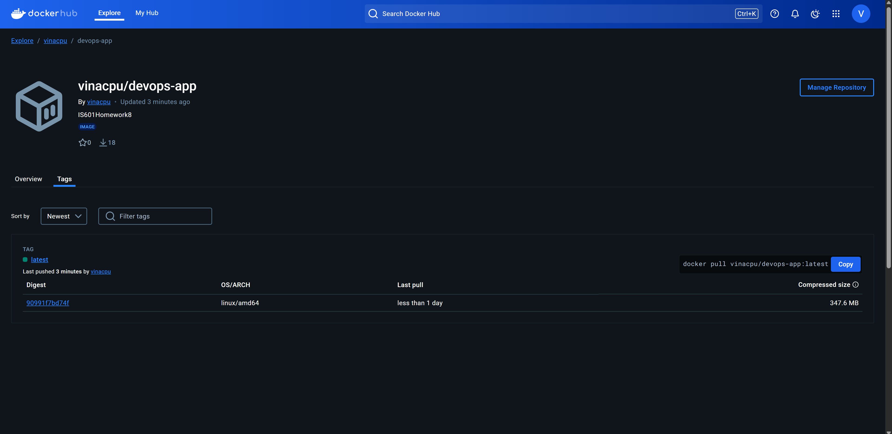
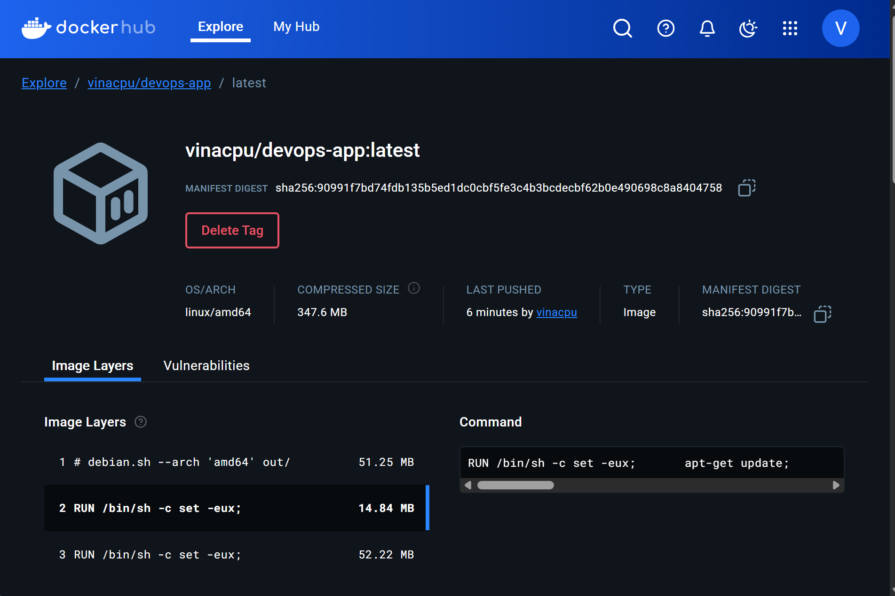

# Devops

## 2 Run In Docker in Terminal

docker build -t devops-app . 

docker run devops-app

docker run devops-app -m pytest

docker run devops-app pytest --pylint --cov

## All Saved to Docker Image Automatically

Note: Please tell me if these are not the specific images you need!
